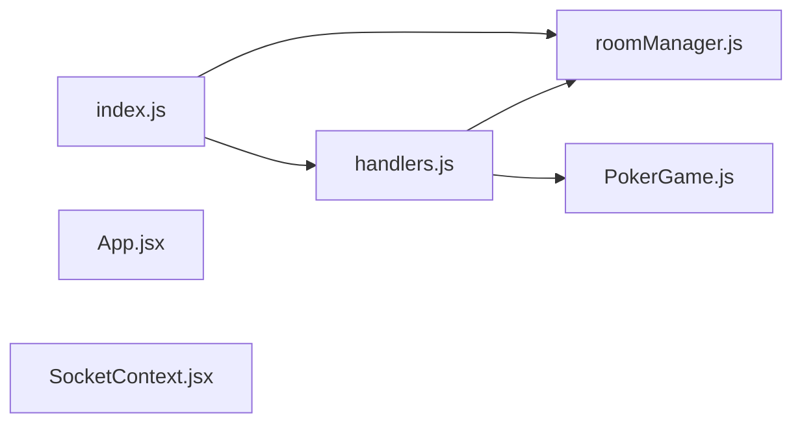

# System Architecture Overview

This document describes the full-stack architecture for developers contributing to the project. It covers how client React components communicate with the server via Socket.IO, the key structural components, and the boundaries between different parts of the system.

## Architecture Overview

The system follows a client-server architecture with real-time bidirectional communication. React-based clients connect to a Node.js server that manages poker rooms and game logic.

## Server-Side Architecture

### Entry Point: `server/index.js`

The server entry point imports two key modules:

- `roomManager.js` — manages room lifecycle
- `handlers.js` — handles Socket.IO event handlers

### Room Management: `server/utils/roomManager.js`

The `RoomManager` class provides an in-memory store for active poker rooms:

- Uses a `Map` to store room instances keyed by room identifier
- Provides `createRoom()`, `getRoom()`, and `deleteRoom()` methods
- Includes `getRoomBySocketId()` for looking up a room given a socket identifier
- Includes `cleanupEmptyRooms()` for managing room lifecycle

When creating a room, if a room with the same ID already exists, it deletes the old instance first to ensure a fresh state.

### Socket Handlers: `server/socket/handlers.js`

The `setupSocketHandlers()` function configures Socket.IO event handling for each connected client.

**Key internal helper functions:**

- `scoreboardKey()` — derives a lookup key from a player object using session token, player ID, or socket identifier
- `migrateScoreboardKey()` — transfers scoreboard entries when a player's key changes (e.g., reconnection)
- `upsertScoreboard()` — updates or inserts a player's scoreboard entry, preserving existing fields while ensuring player ID and connection status reflect current state

**Timer management:**

- `startPlayerTimer()` — starts a countdown timer for the current player to act; when the betting round completes, it advances the street or ends the hand and emits a `hand-complete` event with results and room state; auto-starts the next hand after a delay
- `stopPlayerTimer()` — stops and clears a timer for a given room using an internal Map to track timers by room

### Game Engine: `server/engine/PokerGame.js`

The `PokerGame` class encapsulates core poker logic:

- Manages deck, community cards, pot, and side pots
- Tracks the street progression (preflop, flop, turn, river, showdown)
- Maintains a `BettingRound` instance for handling street-by-street betting
- Tracks the betting aggressor in a betting round to identify who made the last raise
- Implements position assignment via `assignPositions()` for players seated at the table

**Rabbit Hunt feature:**

- `triggerRabbitHunt()` — reveals remaining community cards that would have been dealt; requires the hand to be ended (`bettingRound === null`), rabbit hunt to not already be revealed, and cards to be available
- `getRabbitHuntState()` — returns availability status, reveal status, card count, and card data
- Controlled by `room.settings.allowRabbitHunt`

**JSON serialization:**

The `toJSON()` method exposes game state including pot, community cards, dealer position, current street, betting round details, current player, and rabbit hunt state.

### Additional Game Modules

| Module | Path | Purpose |
|--------|------|---------|
| `BettingRound.js` | `server/engine/` | Handles street-level betting logic; exposes `toJSON()` for serialization |
| `HandEvaluator.js` | `server/engine/` | Evaluates poker hands and determines winners |
| `RabbitHunt.js` | `server/engine/` | Static utility methods for rabbit hunt (e.g., `isAvailable()`, `getCompleteBoard()`) |
| `RunItTwice.js` | `server/engine/` | Handles run-it-twice scenarios when all-in before the river |

### Data Models

**Player model (`server/models/Player.js`):**

- `sitDown()` — assigns a seat, restores chips from persistent stack, sets status to active, and clears standing-up flag
- `standUp()` — saves chips to persistent stack, clears seat, empties chips, sets status to waiting
- `resetForNewHand()` — clears current bet, total contribution, hole cards, and action tracking; sets status to active
- `resetForNewRound()` — clears current bet and action tracking (does not clear total contribution)
- `toJSON()` — serializes player state for client; notably excludes hole cards from public JSON

**Room model (`server/models/Room.js`):**

- `addPlayer()` — adds a player up to the room's limit; first player automatically becomes host
- `getPlayer()` — finds player by socket ID
- `getPlayerBySession()` — finds player by session token
- `getPlayerById()` — finds player by player ID
- `removePlayer()` and `removePlayerBySession()` — removes players and reassigns host if needed
- `isHost()` — checks if a socket ID is the host
- `isHostSession()` — checks if a session token is the host session
- `isHostPlayer()` — checks if a player ID matches the host player
- `getSeatedPlayers()` — returns players with assigned seats

## Client-Side Architecture

### Application Entry: `client/src/App.jsx`

The `App` component sets up routing using React Router:

- `/` — renders the `Lobby` component
- `/room` and `/room/` — redirects to home (incomplete URL)
- `/room/:roomId` — renders the `PokerRoom` component
- `*` — catch-all redirects to home

All routes are wrapped in `SocketProvider` to enable Socket.IO connectivity throughout the application.

### Socket Context: `client/src/context/SocketContext.jsx`

**`SocketProvider`:**

- Manages the Socket.IO connection state
- Connects to the server URL specified in an environment variable (defaults to `http://localhost:3001`)
- Socket is created with `autoConnect: false` initially
- Sets up listeners for socket lifecycle events
- Cleans up the socket connection on unmount

**`useSocket`:**

- Returns the socket instance and connection status
- Throws an error if used outside of `SocketProvider`

## Key Design Decisions

### 1. Socket.IO for Real-Time Communication

The system uses Socket.IO exclusively for client-server communication. This enables:

- Bidirectional event-based messaging
- Automatic reconnection handling
- Room-based message routing (via Socket.IO rooms)

### 2. In-Memory Room Storage

The `RoomManager` uses a JavaScript `Map` for storing room instances in memory. Key implications:

- Rooms persist as long as the server runs
- No database is required for basic operation
- Rooms are not persisted across server restarts

### 3. Scoreboard as Room-Level State

The scoreboard is stored at the `Room` level rather than the `PokerGame` level. This allows:

- Tracking player performance across multiple hands
- Migrating entries when players reconnect (key changes from socket ID to persistent ID)
- Persistence independent of individual game instances

### 4. Server-Authoritative Game State

All game logic runs on the server:

- `PokerGame` manages deck, community cards, pot, and betting rounds
- `Player` model manages chips, status, and actions
- Timer management (`startPlayerTimer`, `stopPlayerTimer`) runs on the server

### 5. JSON Serialization for State Transfer

Both `PokerGame.toJSON()` and `BettingRound.toJSON()` provide serialization methods. This pattern:

- Separates internal game state from client-facing data
- Allows selective exposure of information (e.g., hole cards excluded from public player JSON)
- Facilitates consistent state broadcasting to clients

### 6. Host Management

The first player to join a room becomes the host automatically. Host status is tracked via room methods like `isHost()`, `isHostSession()`, and `isHostPlayer()`. The system automatically reassigns host when the current host leaves using `Room.transferHost()`.

## System Boundaries

### Client-Server Boundary

| Aspect | Location | Description |
|--------|----------|-------------|
| React UI | `client/src/` | Renders game state, receives updates via Socket.IO events |
| Socket Context | `client/src/context/SocketContext.jsx` | Manages Socket.IO connection lifecycle |
| Server Entry | `server/index.js` | Initializes Express (implied) and Socket.IO handlers |
| Event Handlers | `server/socket/handlers.js` | Receives client actions, emits game state updates |

### Server Module Boundaries

| Module | Responsibility |
|--------|----------------|
| `roomManager.js` | Room lifecycle and lookup |
| `handlers.js` | Socket event routing and player action handling |
| `PokerGame.js` | Core poker rules and state |
| `BettingRound.js` | Street-level betting logic |
| `Room.js` | Room state and player management |
| `Player.js` | Individual player state and actions |

### Game State Flow

1. Client sends action via Socket.IO events
2. `handlers.js` receives the action and validates it
3. `PokerGame` and related classes update game state
4. Server emits updated state to all clients in the room
5. `SocketContext.jsx` receives the event on the client
6. React components re-render with new state

## Communication Patterns

### Client → Server

Actions are sent via Socket.IO events to `handlers.js`, which validates and processes them through the game engine.

### Server → Client

The server emits state updates to all clients in a room using `io.to(roomId).emit()`. Key events include:

- `hand-complete` — emitted when a hand ends with results and room state

### Persistent vs. Ephemeral State

| State Type | Storage | Examples |
|------------|---------|----------|
| Persistent | Player's stored balance, session information | Survives across hands |
| Ephemeral | Chips in play, betting amounts, per-hand status, per-round cards | Resets each hand or round |