# Texas Hold'em Poker Socket.IO Application

## Overview

This document describes the architecture, data models, and Socket.IO event protocol for a real-time Texas Hold'em poker application. The system uses Node.js with Express for the server, Socket.IO for bidirectional communication, and a client-side React context to manage socket connections.

## Architecture

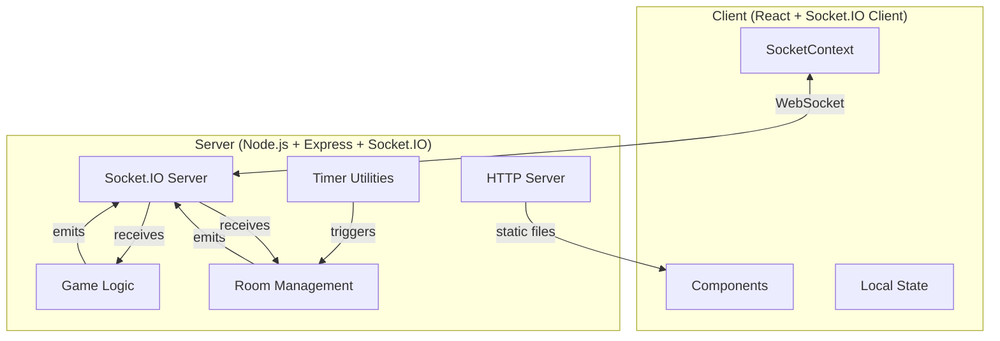

## Module Structure

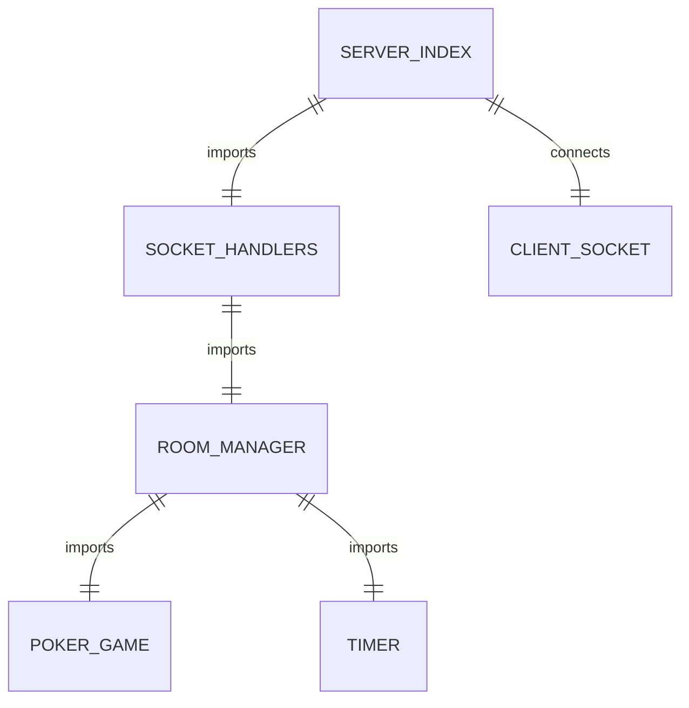

### Module Responsibilities

| Module | File | Responsibility |
|--------|------|----------------|
| `index.js` (server) | `server/index.js` | HTTP/Socket.IO server initialization |
| `handlers.js` | `server/socket/handlers.js` | Socket event routing and response |
| `roomManager.js` | `server/utils/roomManager.js` | Player/room lifecycle management |
| `PokerGame.js` | `server/utils/PokerGame.js` | Core game state and rules |
| `Timer.js` | `server/utils/Timer.js` | Round/action timing utilities |
| `SocketContext.jsx` | `client/src/contexts/SocketContext.jsx` | Client socket connection management |
| `poker-engine.js` | `client/src/utils/poker-engine.js` | Card combinations and hand evaluation |

## Data Models

### `Room` Model

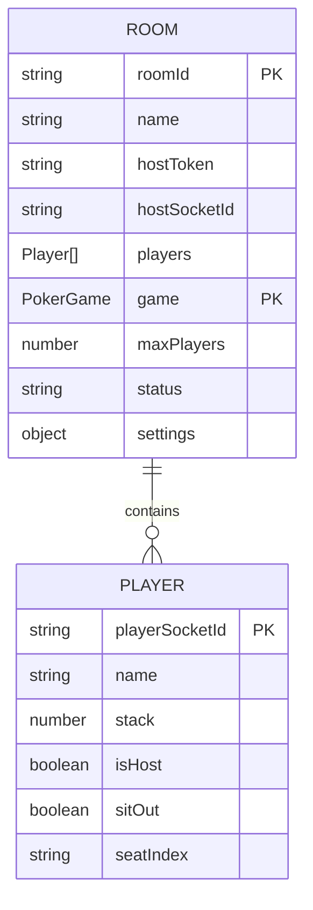

**Source Code:**

```javascript
// server/utils/roomManager.js
const roomStorage = new Map();
```

### `Player` Model

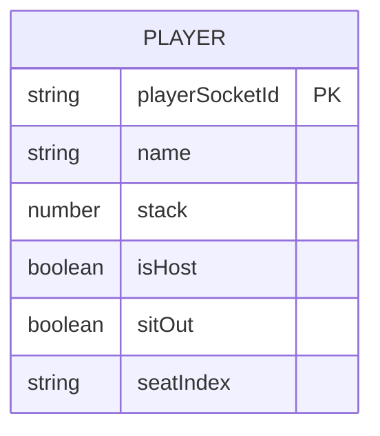

**Source Code:**

```javascript
// server/utils/roomManager.js
class Player {
  constructor(playerSocketId, name, stack, isHost = false) {
    this.playerSocketId = playerSocketId;
    this.name = name;
    this.stack = stack;
    this.isHost = isHost;
    this.sitOut = false;
    this.seatIndex = null;
  }
}
```

### `PokerGame` Model

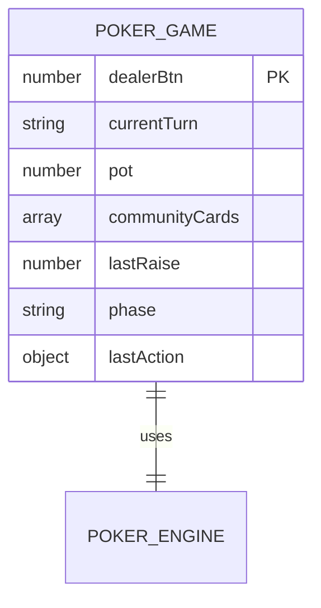

**Source Code:**

```javascript
// server/utils/PokerGame.js
class PokerGame {
  constructor(players, bigBlind, buyIn) {
    this.dealerBtn = 0;
    this.currentTurn = null;
    this.pot = 0;
    this.communityCards = [];
    this.players = players;
    this.lastRaise = bigBlind;
    this.phase = 'preflop';
    this.lastAction = null;
    this.bigBlind = bigBlind;
    this.buyIn = buyIn;
  }
}
```

### Scoreboard Model

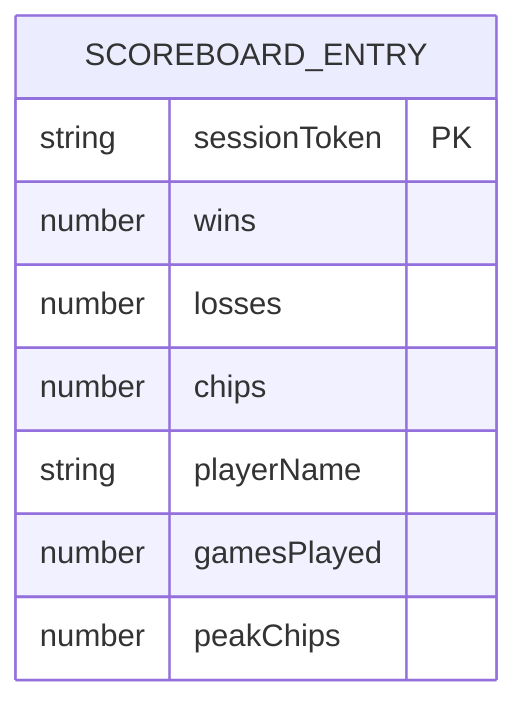

**Source Code:**

```javascript
// server/utils/scoreboard.js
function upsertScoreboard(sessionToken, data) {
  const entry = scoreboard.get(sessionToken) || {
    sessionToken,
    wins: 0,
    losses: 0,
    chips: 0,
    playerName: data.playerName,
    gamesPlayed: 0,
    peakChips: 0,
  };
}
```

### `Timer` Model

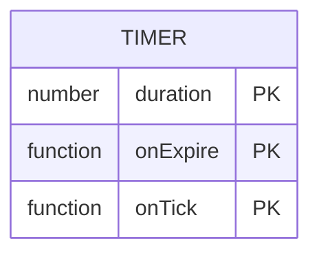

**Source Code:**

```javascript
// server/utils/Timer.js
class Timer {
  constructor(duration, onExpire, onTick) {
    this.duration = duration;
    this.onExpire = onExpire;
    this.onTick = onTick;
    this.interval = null;
  }
}
```

## Socket.IO Event Protocol

### Event Flow Overview

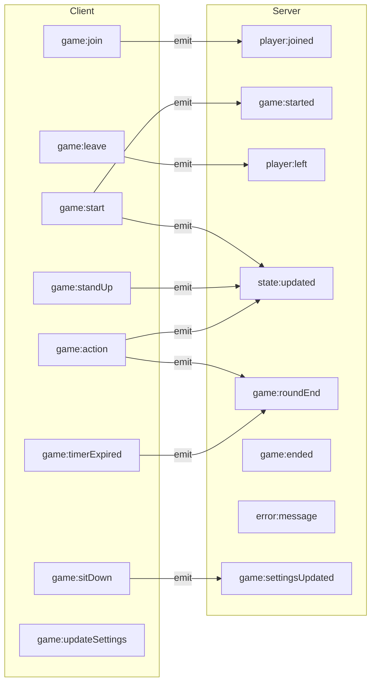

### Client → Server Events

| Event | Payload | Handler | Description |
|-------|---------|---------|-------------|
| `game:join` | `{ name, stack, sessionToken }` | join | Player joins a room |
| `game:start` | `{ hostToken }` | start | Host initiates game |
| `game:leave` | `{}` | leave | Player leaves room |
| `game:action` | `{ action, amount? }` | action | Player submits action |
| `game:timerExpired` | `{}` | timerExpired | Timer expired notification |
| `game:sitDown` | `{ seatIndex }` | sitDown | Player sits at table |
| `game:standUp` | `{}` | standUp | Player stands from table |
| `game:updateSettings` | `{ settings }` | updateSettings | Host updates game settings |

**Source Code:**

```javascript
// server/socket/handlers.js
socket.on('game:join', (data) => handleJoin(socket, data));
socket.on('game:start', (data) => handleStart(socket, data));
socket.on('game:leave', (data) => handleLeave(socket, data));
socket.on('game:action', (data) => handleAction(socket, data));
socket.on('game:timerExpired', (data) => handleTimerExpired(socket, data));
socket.on('game:sitDown', (data) => handleSitDown(socket, data));
socket.on('game:standUp', () => handleStandUp(socket));
socket.on('game:updateSettings', (data) => handleUpdateSettings(socket, data));
```

### Server → Client Events

| Event | Payload | Description |
|-------|---------|-------------|
| `player:joined` | `{ room, players, sessionToken }` | Confirmation of join |
| `player:left` | `{ playerSocketId, room }` | Player departure notification |
| `game:started` | `{ room }` | Game start confirmation |
| `state:updated` | `{ room }` | Updated game state |
| `game:roundEnd` | `{ room, event }` | Round completion (flop/turn/river/showdown) |
| `game:ended` | `{ room, event }` | Game completion |
| `game:settingsUpdated` | `{ settings }` | Settings changed |
| `error:message` | `{ message, code }` | Error notification |

**Source Code:**

```javascript
// server/socket/handlers.js
socket.emit('player:joined', { room, players, sessionToken });
socket.emit('player:left', { playerSocketId, room });
socket.emit('game:started', { room });
socket.to(targetRoom).emit('state:updated', { room });
socket.to(targetRoom).emit('game:roundEnd', { room, event });
socket.to(targetRoom).emit('game:ended', { room, event });
socket.to(targetRoom).emit('game:settingsUpdated', { settings });
socket.emit('error:message', { message, code });
```

## Server Runtime Sequence

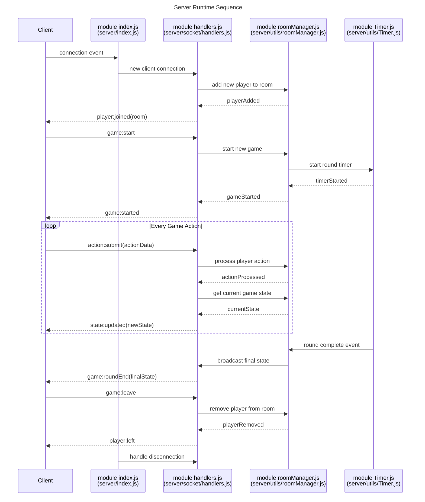

### Export Functions from roomManager.js

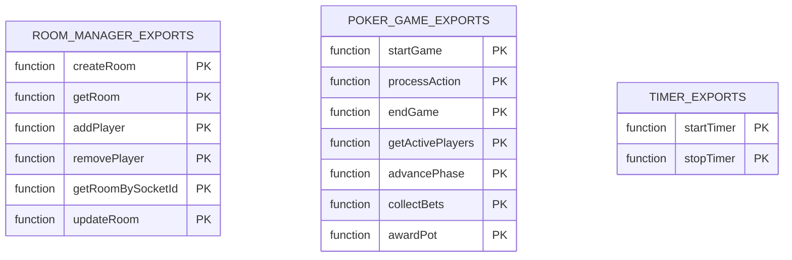

## Client Socket Management

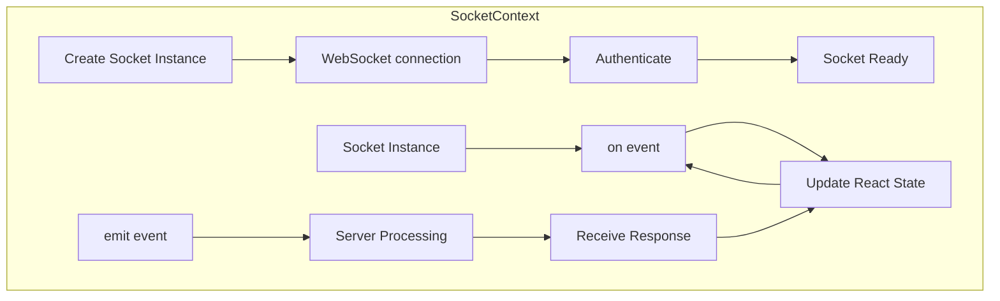

**Source Code:**

```javascript
// client/src/contexts/SocketContext.jsx
const socket = io(import.meta.env.VITE_SERVER_URL || '', {
  auth: {
    sessionToken,
  },
  transports: ['websocket'],
  reconnection: true,
  reconnectionDelay: 1000,
  reconnectionAttempts: 5,
});

// Connection lifecycle
socket.on('connect', () => {
  console.log('Connected to server');
  setConnected(true);
});

socket.on('disconnect', () => {
  console.log('Disconnected from server');
  setConnected(false);
});

// Game state listeners
socket.on('state:updated', (data) => {
  setGameState(data.room);
});

socket.on('game:started', (data) => {
  setGameState(data.room);
  setGameStatus('playing');
});

socket.on('player:joined', (data) => {
  setRoomId(data.room.roomId);
});

socket.on('error:message', (data) => {
  console.error('Error:', data.message);
  alert(data.message);
});

// Emit player actions
function submitAction(action, amount = 0) {
  socket.emit('game:action', { action, amount });
}

function joinRoom(playerName, stack, sessionToken) {
  socket.emit('game:join', { name: playerName, stack, sessionToken });
}