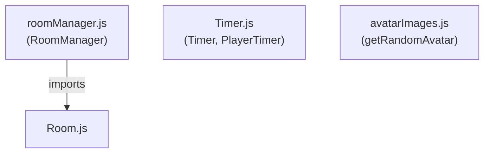

# Server Utilities Component Design Document

## Overview

The Server Utilities subsystem provides core infrastructure for room management, player turn timing mechanics, and avatar image selection. This subsystem is responsible for maintaining game room state, enforcing time constraints on player actions, and supplying avatar assets for player profiles.

---

## Architecture

### Module Structure

The subsystem comprises three primary modules:

1. **roomManager.js** — Manages creation, retrieval, and deletion of game rooms
2. **Timer.js** — Provides countdown timer mechanics with callback support
3. **avatarImages.js** — Supplies random avatar selection functionality

### Dependency Graph



---

## Component Responsibilities

### RoomManager

**Purpose:** Central registry for game room lifecycle management.

**Responsibility:**
- Maintain a collection of active rooms indexed by room ID
- Provide creation of new rooms with initial configuration
- Retrieve rooms by ID or by associated socket ID
- Delete rooms from the registry
- Support room cleanup operations

**Internal Structure:**

See source code for full implementation details.

### Timer

**Purpose:** Provide a reusable countdown mechanism with state callbacks.

**Responsibility:**
- Track elapsed and remaining time in seconds
- Execute periodic tick callbacks during countdown
- Execute expiration callback when duration reaches zero
- Support lifecycle operations
- Allow manual time adjustments

**Internal Structure:**

```
Timer
├── duration: number (seconds)
├── remaining: number (seconds)
├── interval: NodeJS.Timeout | null
├── isRunning: boolean
└── Methods:
    └── See source code for full details
```

**Callback Signatures:**
- Tick callback: Invoked each second during countdown (before final second)
- Expiration callback: Invoked when timer reaches zero and stops

### PlayerTimer

**Purpose:** Manage time allocation for individual player actions, including optional time bank withdrawal.

**Responsibility:**
- Wrap a Timer instance for player-specific turn constraints
- Track time bank balance and usage per turn
- Calculate and deduct time bank when action completes
- Emit state updates to connected clients via WebSocket
- Support custom expiration handlers

**Internal Structure:**

```
PlayerTimer
├── player: object
├── actionTime: number (seconds)
├── timeBank: number (seconds)
├── io: WebSocket namespace
├── usingTimeBank: boolean
├── timer: Timer
└── Methods:
    └── See source code for full details
```

**Callback Hooks:**
- Internal tick callback managing state updates
- Internal expiration callback handling timer expiration logic
- User-assignable handler for application-specific expiration behavior

### getRandomAvatar

**Purpose:** Supply random avatar image selection for player profiles.

**Responsibility:**
- Return a randomly selected avatar from a predefined collection

**Signature:**
```
getRandomAvatar() → string (avatar identifier or path)
```

---

## Data Flow

### Room Creation Flow

```
RoomManager.createRoom(roomId, settings)
  ├── Check if room exists
  │   └── If true: deleteRoom(roomId)
  ├── Instantiate Room(roomId, settings)
  ├── Store in rooms Map
  └── Log creation event
```

**Behavior:** If a room with the given `roomId` already exists, it is deleted first to ensure a fresh state. The new Room instance is then created with the provided settings and stored in the `rooms` Map.

### Room Lookup Flow

**By Room ID:**
```
RoomManager.getRoom(roomId)
  └── Return rooms.get(roomId) or undefined
```

**By Socket ID:**
```
RoomManager.getRoomBySocketId(socketId)
  ├── Iterate all rooms
  ├── Check if room contains player with socketId
  └── Return first matching room or null
```

### Timer Lifecycle Flow

```
Timer.start()
  └── Set interval to decrement remaining every 1000ms
      ├── Call tick callback if defined and remaining > 1
      ├── Check if remaining <= 0
      │   ├── If true: stop()
      │   └── Call expiration callback if defined
      └── Set isRunning = true
```

```
Timer.stop()
  ├── Clear interval
  └── Set isRunning = false
```

```
Timer.reset(duration?)
  ├── stop()
  ├── Update duration if provided
  └── Reset remaining to duration
```

### Player Timer Flow

```
PlayerTimer.start()
  └── Delegate to timer.start()
```

```
PlayerTimer.stop()
  ├── Delegate to timer.stop()
  └── Charge time bank deductions
```

```
Charge time bank deductions
  ├── If usingTimeBank:
  │   ├── Calculate time bank amount used
  │   ├── Store usage amount
  │   └── Deduct from player.timeBank (minimum 0)
  └── Update player state
```

---

## Interface Contracts

### RoomManager

See source code for full method signatures and implementation details.

### Timer

| Method | Parameters | Return Type | Behavior |
|--------|-----------|-------------|----------|
| `start` | none | `void` | Begins countdown; no-op if already running |
| `stop` | none | `void` | Halts countdown and clears interval |
| `reset` | `duration?: number` | `void` | Stops timer, optionally updates duration, resets remaining to duration |

### PlayerTimer

| Method | Parameters | Return Type | Behavior |
|--------|-----------|-------------|----------|
| `start` | none | `void` | Delegates to underlying Timer.start() |
| `stop` | none | `void` | Stops timer and charges time bank deductions |

### avatarImages

| Export | Signature | Behavior |
|--------|-----------|----------|
| `getRandomAvatar` | `() → string` | Returns a randomly selected avatar from the available collection |

---

## Key Design Patterns

### Timer Callback Model

Timers use callbacks to separate timing logic from application behavior. PlayerTimer wraps Timer and provides its own callback implementations, allowing custom handlers to be assigned for application-specific expiration behavior.

### Room Idempotency

RoomManager ensures that creating a room with an existing ID does not result in duplicate registrations. The existing room is deleted before the new one is created, guaranteeing a fresh state.

### Time Bank Deferred Charging

PlayerTimer does not immediately deduct time bank usage. Instead, it tracks the amount and charges it only when `stop()` is called, allowing for centralized cleanup and state consistency.

---

## Notes

- Timer intervals use 1-second granularity (1000 ms); sub-second precision is not supported.
- Tick callbacks are invoked each second of the countdown except on the final second (when remaining <= 1).
- PlayerTimer's internal callbacks emit state updates via WebSocket; see source code for full details.